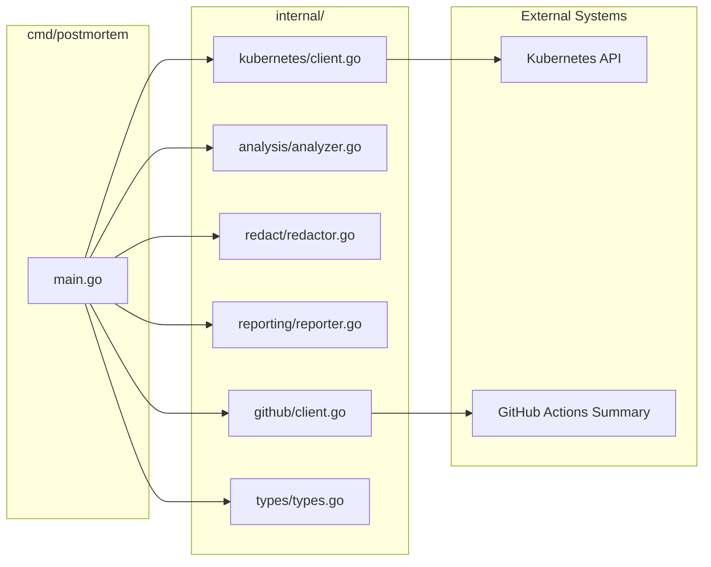
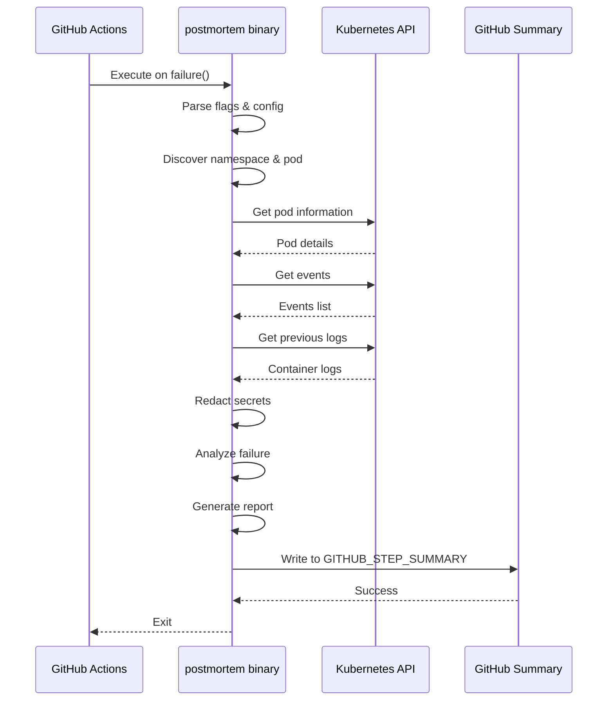
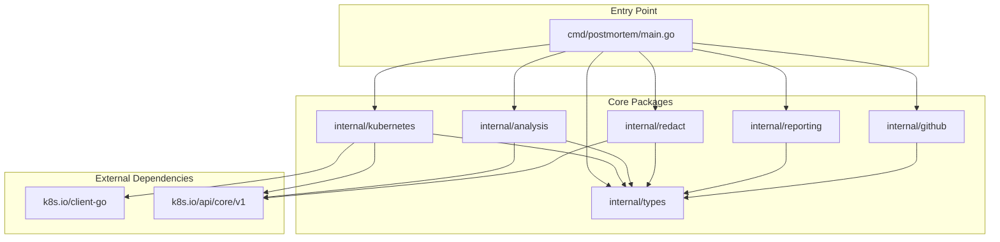
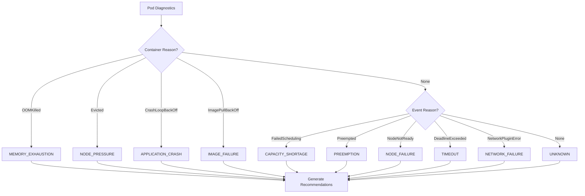
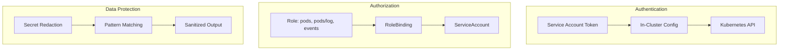
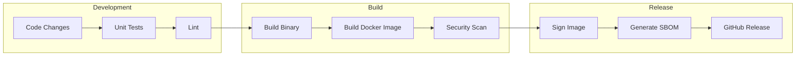

# Architecture

## High-Level Architecture

```mermaid
flowchart TB
    subgraph "GitHub Actions Workflow"
        A[Job Running in Ephemeral Runner Pod]
        B{Job Status}
        A --> B
    end

    subgraph "k8s-pod-postmortem Action"
        C[1. Identify Current Pod]
        D[2. Authenticate via Service Account]
        E[3. Query Kubernetes API]
        F[4. Gather Events & Logs]
        G[5. Analyze Failure Causes]
        H[6. Generate Markdown Report]
        
        C --> D --> E --> F --> G --> H
    end

    subgraph "GitHub Job Summary"
        I[Root Cause Report]
        J[Events Timeline]
        K[Container Exit Reasons]
        L[Previous Logs]
        M[Recommendations]
    end

    B -->|failure() or cancelled()| C
    H --> I
    H --> J
    H --> K
    H --> L
    H --> M
```

## Component Architecture



## Data Flow



## Internal Package Dependencies



## Failure Classification Flow



## Security Architecture



## CI/CD Pipeline Architecture


