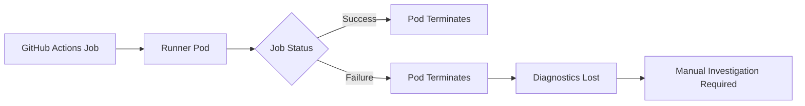
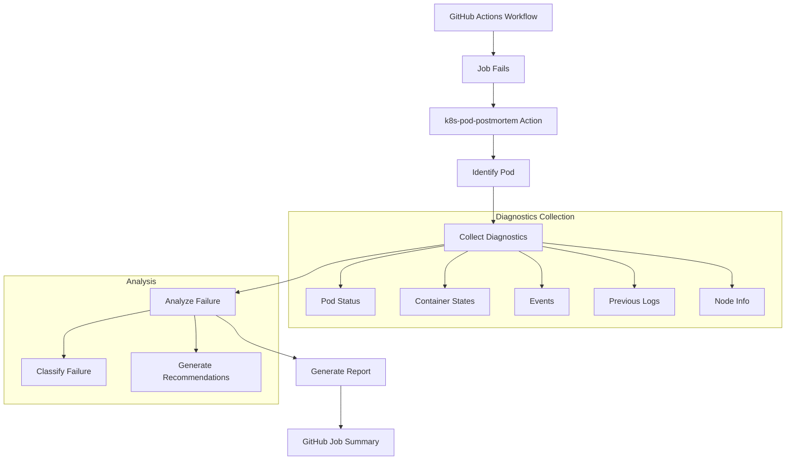
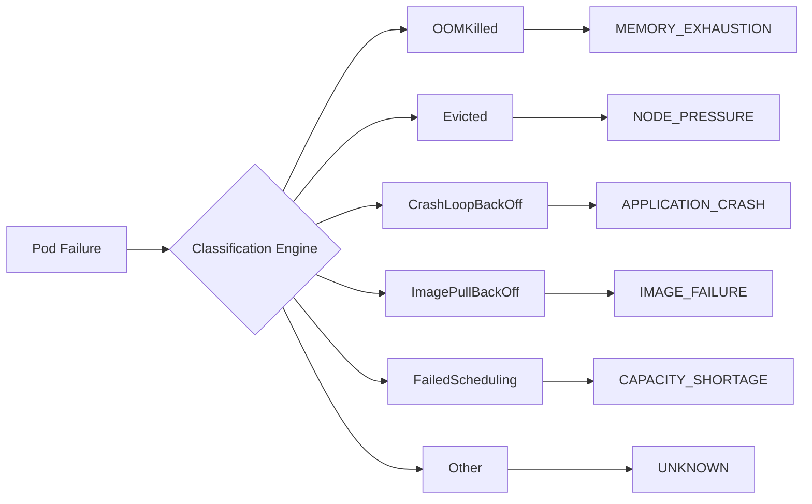

# Overview

## What is k8s-pod-postmortem?

k8s-pod-postmortem is a Kubernetes-native GitHub Action designed to automatically capture, preserve, analyze, and surface pod-level failure diagnostics for ephemeral self-hosted GitHub Actions runners running inside Kubernetes clusters.

## Problem Statement

When GitHub Actions jobs run on self-hosted Kubernetes runners:

**The Problem**: Ephemeral runner pods disappear before engineers can investigate why a pipeline failed. The actual root cause remains hidden inside Kubernetes internals.

### Common Hidden Failure Modes

| Failure Type | Description | Detection Method |
|--------------|-------------|------------------|
| OOMKilled | Container exceeded memory limit | Container status |
| Evicted | Node under memory/disk pressure | Pod events |
| Preempted | Spot/preemptible node interruption | Pod events |
| CrashLoopBackOff | Application repeatedly crashing | Container status |
| ImagePullBackOff | Registry/image authentication issues | Container status |
| FailedScheduling | Resource constraints or taints | Pod events |
| NodeNotReady | Worker node unavailable | Node conditions |
| DeadlineExceeded | Pod startup timeout | Pod status |
| CNI Failures | Network plugin issues | Pod events |

## Solution

k8s-pod-postmortem automatically collects failure context and publishes a structured post-mortem report directly into the GitHub Actions Job Summary UI.

## Key Features

### 1. Automatic Diagnostics Collection

- Pod information and status
- Container states (exit codes, restart counts)
- Kubernetes events timeline
- Previous container logs
- Node information (optional)

### 2. Failure Classification Engine

### 3. Security Best Practices

- Zero static credentials
- Least privilege RBAC
- Secret redaction from logs
- Namespace-scoped permissions

### 4. GitHub Integration

- Job Summary UI integration
- Output variables for downstream jobs
- Markdown report generation

## Benefits

| Before | After |
|--------|-------|
| Manual kubectl investigation | Automatic diagnostics collection |
| Pods disappear before debugging | Evidence preserved |
| Generic error messages | Detailed root cause analysis |
| Repetitive support requests | Self-service diagnostics |
| High MTTR | Reduced MTTR >50% |

## Use Cases

1. **CI/CD Pipeline Failures**: Automatically diagnose why builds or tests failed
2. **Spot Instance Interruptions**: Identify preemption events
3. **Resource Constraints**: Detect OOM kills and scheduling failures
4. **Image Issues**: Troubleshoot container image pull failures
5. **Network Problems**: Identify CNI-related failures

## Supported Environments

- Kubernetes 1.20+
- AWS EKS
- Google GKE
- Azure AKS
- Self-managed Kubernetes clusters
- Any Kubernetes-compliant environment